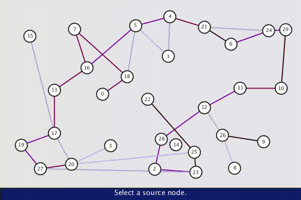

# Processing Sketches

## About

A collection of small sketches put together in the [Processing](http://www.processing.org) environment.

## How to view

In order to run the sketches, you will need to download and install [Processing](http://www.processing.org).

To open a sketch in Processing, go to File > Open. Select the directory containing the project you wish to open, and open the .pde file that has the same name as the directory.

## Sketches

### Attraction

Particles swarm around the canvas and are attracted to/repelled from one another, creating interesting patterns that vary as you tweak the parameters in the attractive and repulsive forces.

### Cycloids

Visualization of the lines traced out by a point on a circle rotating along a bigger circle's circumference.

### Dijkstra

Generates a random weighted graph, then uses Dijkstra's shortest path algorithm to find the shortest distance between two nodes.

### Matrix Compression

Simple projection of an image's grayscale values onto a subspace, used as an inefficient and very lossy compression algorithm.

### P5-15 Puzzle

Strictly speaking not a _Processing_ sketch, this one runs on p5js. It is the classic "15 puzzle", complete with a solving algorithm (A* with manhattan distance)
(Live Demo)[https://editor.p5js.org/dliberat/sketches/QvVNgFY5H]

